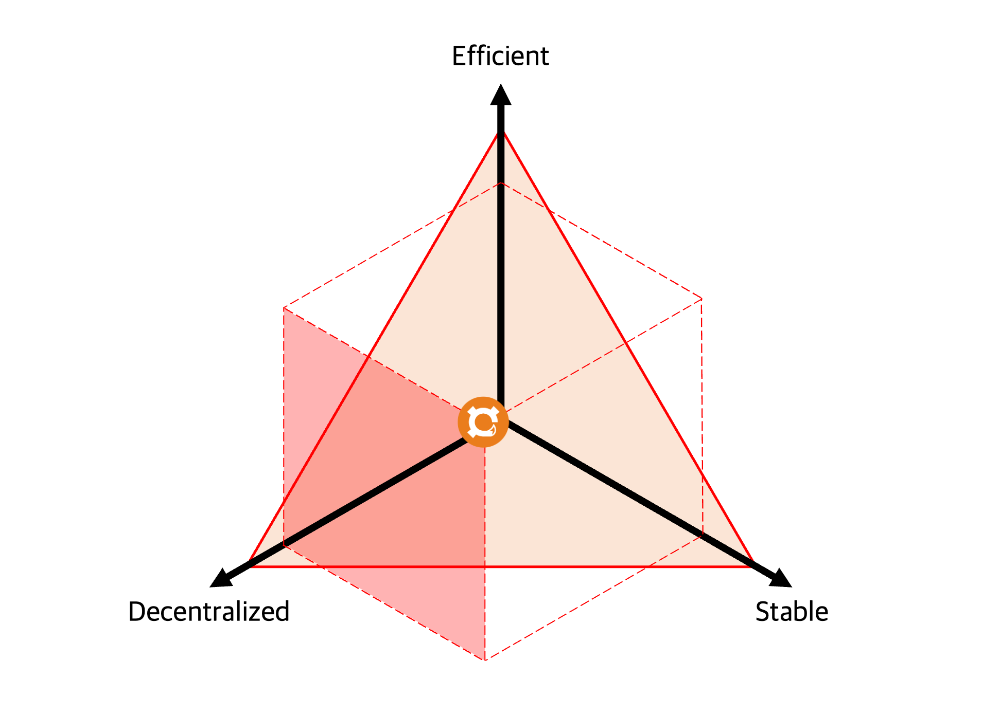

# FOX

Decentralization is an essential thing for DeFi to exist as a truly De-Fi. So, we created FOX. We adopted the idea of FRAX but used decentralized collaterals rather than fiat or fiat-backed ones.

FOX is the first fully decentralized capital-efficient over-collateralized stablecoin, where a secure algorithm adjusts capital efficiency and stability.

The top priority was to exclude centralization risk through complete decentralization. The protocol safely adjusts efficiency and stability under the trust level, which was designed to satisfy all the properties of the stablecoin.
