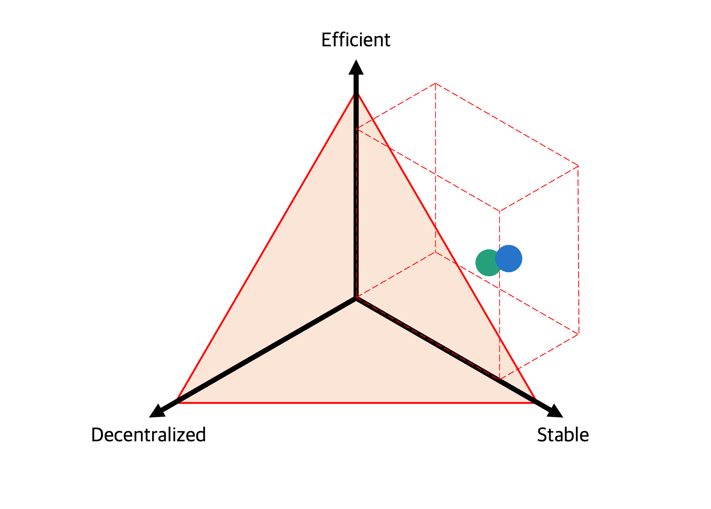
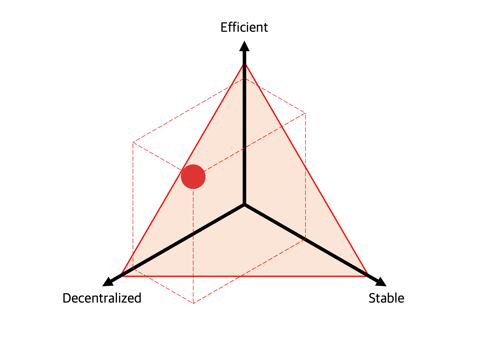

# Stablecoins

As is well known, stablecoins are generally classified into three categories - fiat-collateralized, crypto-collateral, and algorithmic ones.

Based on these classifications and the stablecoin trilemma, let's look at the current status of stablecoins.

---

## Fiat-collateralized

Fiat-collateralized stablecoin has a real dollar as collateral, so it has to be fundamentally stable. But there are many issues due to centralization. For example, there is a risk of censorship and central institutions' failure to invest.

---

## Crypto-collateral

Crypto-collateralized stablecoin is not free from the issue of price fluctuations of collateral. That is why it is always designed to be over-collateralized, so be less efficient.

In order to alleviate the impact of price fluctuations, fiat-collateralized stablecoins are often used as collateral in crypto-collateralized stablecoin. It eventually acts as a wrapped fiat-backed stablecoin, so there is a risk of centralization that harms both decentralization and stability.

---

## Algorithmic

Algorithmic stablecoin has the most flexible structure. Because there is no collateral, it is highly efficient and safe from centralization factors.

However, sufficient verification is needed to determine whether the algorithm works well. We already know about the failure of that one.

---

## Hybrid

To solve this problem, hybrid stable coins combining their characteristics have emerged. For example, FRAX has increased efficiency by using an algorithmic feature in addition to collateralizing USDC.

If FRAX is highly trusted, the protocol increases the weight of the algorithmic part to improve capital efficiency. Conversely, when more trust is required, the protocol re-secures stability by increasing the proportion of fiat-collateralized currency.

This idea has worked well so far. Still, there is a limitation that cannot be free from the centralization issue because a fiat basically backs it.
