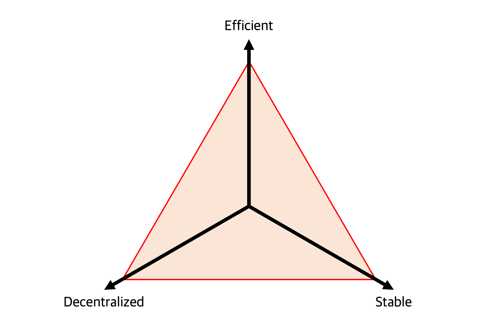

# Trilemma

The most fundamental component in DeFi is obviously stablecoin. However, as shown in several issues, the ideal stablecoin that meets decentralization, stability, and capital efficiency has yet to exist nowadays. Until just before.

We tried to find the solution and finally designed `FOX`, the ideal stablecoin.
