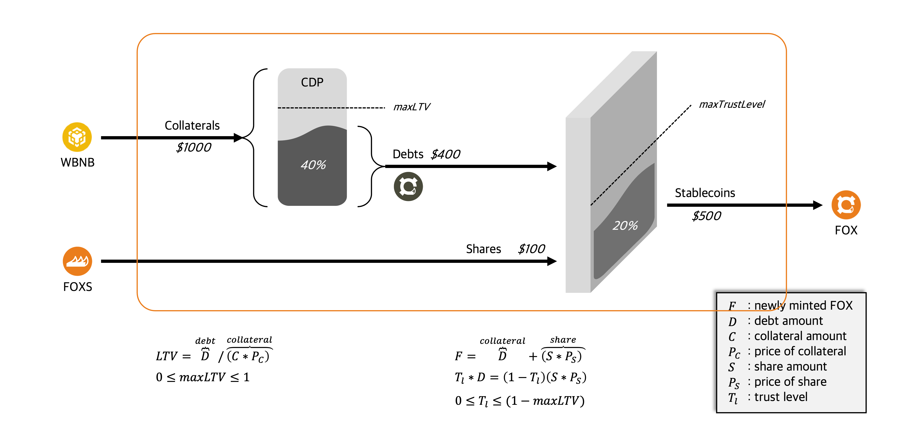

# Minting & Redeem




## Minting

- Only CDP Owner

```
                    MAX LTV: L%
+------------+          LTV: x%      +------------+
|    BNB     |-----------+---------->|    FOX     |
+------------+           |           +------------+
   Collateral            |              Stablecoin
                         |
+------------+           |
|    FOXS    |-----------+
+------------+   
       Shares
```

1. Approve `WETH` to `FoxFarm`.
2. Approve `FOXS` to `FoxFarm`.
3. Execute `openAndDepositAndBorrow()` in `FoxFarm`.

## Redeeming

- Only CDP Owner

```
                    MAX LTV: L%
+------------+          LTV: x%      +------------+
|    BNB     |<----------+-----------|    FOX     |
+------------+           |           +------------+
   Collateral            |              Stablecoin
                         |
+------------+           |
|    FOXS    |<----------+
+------------+   
       Shares
```

1. Approve `FOX` to `FoxFarm`.
2. Execute `repayAndWithdraw()` in `FoxFarm`.
