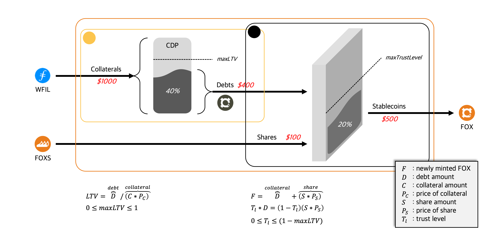

# Overview

FOX was inspired by DAI and FRAX. It has a form of combining them into a seamless one. Like DAI, Debts can be minted from collaterals. Like FRAX, new stablecoins can be created by combining the debts and share tokens.

In other words, it can be understood as a protocol that creates stablecoin FOX through collateral ETH (or FIL, etc.) and share FOXS.
