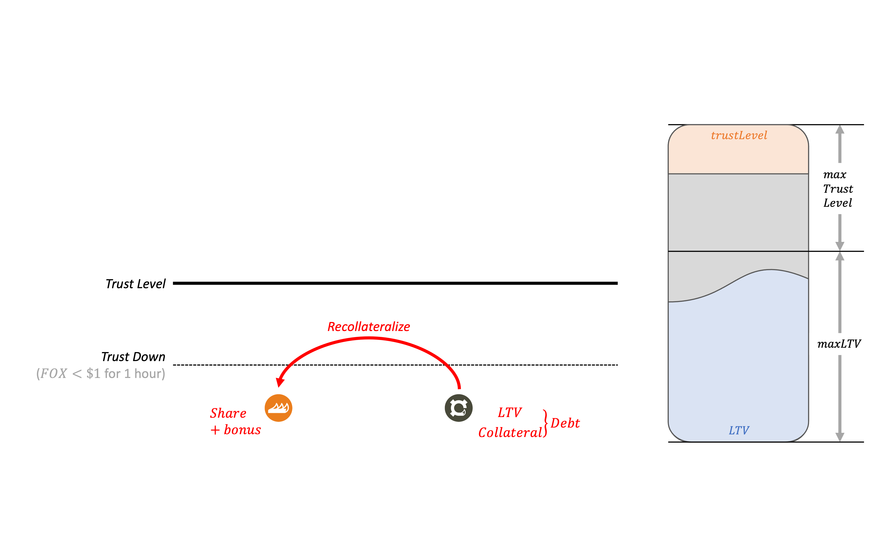

# Recollateralization



`Recollateralize` can be called when FOX remains below $1 for an hour. Users can earn share tokens by raising LTV or minting additional debts.

- Only CDP Owner

```
                    MAX LTV: L%
+------------+          LTV: x++%    +------------+
|   MATIC    |-----------+           |    FOX     |
+------------+           |           +------------+
   Collateral            |              Stablecoin
                         |
+------------+           |
|    FOXS    |<----------+
+------------+   
       Shares
```

The protocol can increase the stablity through these activities by archieving the proportion of collateral. Extra FOXS is given as a bonus to induce Recollateralize.
