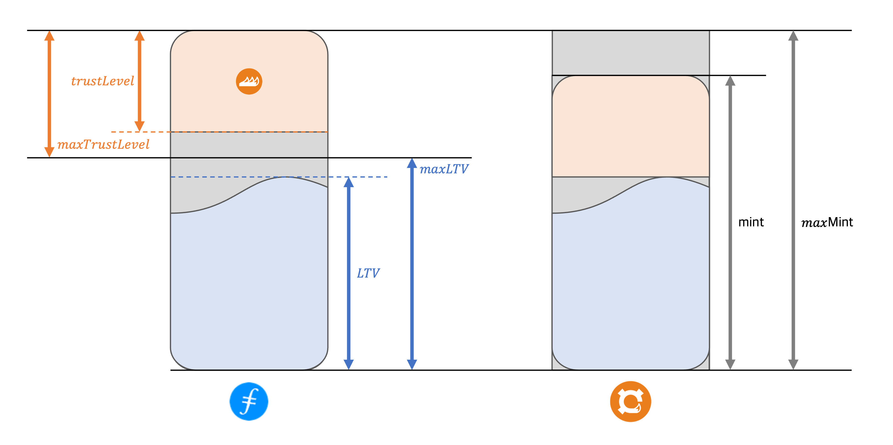

FOX has a `maxLTV` and a `maxTrustLevel` feature that keeps the protocol safe. `maxLTV` is the upper bound of the debt that collateral position can have. `maxTrustLevel` is the upper bound of the trust that the algorithm can adjust.

The trust level is a concept similar to the collateral ratio in FRAX, but there is a difference in that the upper bound exists. If the trust level is 20, it can replace collateral with share tokens by 20 percent.

The upper bound of this trust level is calculated from the `maxLTV`, where 100 minus `maxLTV` is the `maxTrustLevel`. For example, if `maxLTV` is 70%, `maxTrustLevel` is 30%.

It means that the trust level offsets the inefficient part of over-collaterals, and at the same time, the maximum width does not exceed the value of the collateral. Therefore, the protocol is safe because it is over-100% backed.
